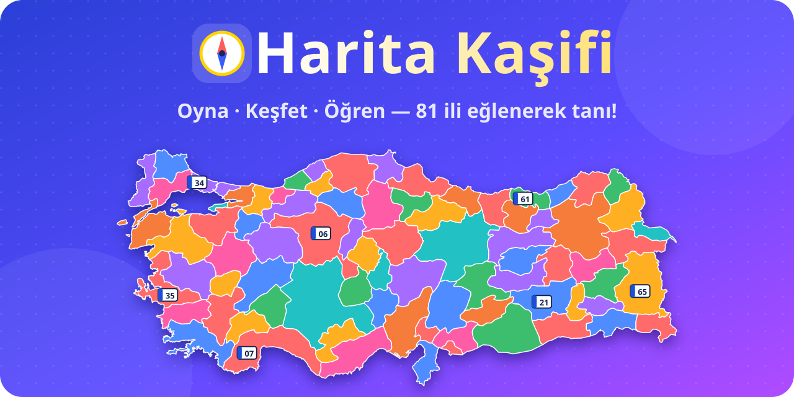
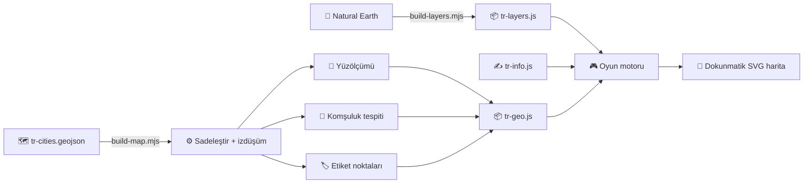

<div align="center">



# 🧭 Harita Kaşifi

### Çocuklar için eğitici, renkli ve kurulabilir Türkiye haritası oyunu

**İle dokun → adını duy → bilgisini öğren → puanı kap!** 🎯

<p>
  <a href="https://harita-kasifi.mlakin.workers.dev"></a>
</p>

<p>
  
  
  
  
  
  
  
</p>

<sub>Veritabanı yok · Sunucu yok · Hesap yok · Reklam yok — sadece öğrenme ve eğlence ✨</sub>

</div>

---

## ✨ Neden Harita Kaşifi?

> Coğrafya ezberlenecek bir liste değil, keşfedilecek bir dünyadır. 🌍

Harita Kaşifi, çocukların **81 ili** oynayarak tanımasını sağlar. Her dokunuşta ilin adı **sesli okunur**, her doğru cevapta harita biraz daha **renklenir**, her ilin kendi **bilgi kartı** vardır. Öğretmenler sınıfta tahtaya yansıtabilir, veliler tablete kurabilir, çocuklar kendi başına oynayabilir.

<table>
<tr>
<td width="50%" valign="top">

### 🎨 Haritayı boyayarak öğren
Keşfedilen ya da doğru bulunan iller soluk renkten **canlı renge** döner. Komşu iller hiçbir zaman aynı renkte olmaz; istersen **bölgelere göre** renklendirme de seçebilirsin.

</td>
<td width="50%" valign="top">

### 🔊 Okumayı bilmeyen de oynar
Sorular ve il adları **Türkçe sesli okunur**. Küçük yaştaki çocuklar da soruyu dinleyerek oynayabilir.

</td>
</tr>
<tr>
<td valign="top">

### 📚 Her il bir hikâye
Plaka, bölge, nüfus, yüzölçümü, **komşular**, meşhur lezzetler, görülecek yerler, **doğal güzellikler** ve bir **"Biliyor muydun?"** bilgisi.

</td>
<td valign="top">

### 🏆 Motive eden oyun
Puanlar, 🔥 art arda doğru serileri, tur sonunda ⭐ yıldızlar, rekorlar ve yanlış yapılan iller için **"Tekrar çalışalım"** listesi.

</td>
</tr>
<tr>
<td valign="top">

### 🏔️ Coğrafi katmanlar
**14 dağ, 17 göl, 13 nehir, 4 deniz ve 2 boğaz** haritanın üzerinde. Her birine dokununca yüksekliği, uzunluğu ya da yüzölçümü, bulunduğu iller ve ilginç bir bilgisi açılır.

</td>
<td valign="top">

### 🔗 Her şey birbirine bağlı
Konya'nın kartında Tuz Gölü, Tuz Gölü'nün kartında Konya, Ankara ve Aksaray çıkar. Çocuk bir karttan diğerine geçerek coğrafyayı bir ağ gibi öğrenir.

</td>
</tr>
<tr>
<td valign="top">

### 🧺 Zenginlikler Atlası
**75 maden, enerji kaynağı, tarım ürünü ve hayvancılık türü.** Fındığa dokun, Karadeniz illeri 🌰 simgeleriyle parlasın. Bora dokun, Eskişehir'den Balıkesir'e bor yatakları görünsün.

</td>
<td valign="top">

### 🌳 Bitki örtüsü ve bölgeler
Türkiye'nin bitki örtüsü haritası (nemli orman, maki, bozkır, dağ çayırı…), endemik bitkiler ve 7 bölgenin iklim, ekonomi ve zenginlik kartları.

</td>
</tr>
</table>

## 🎮 Oyun Modları

| | Mod | Nasıl oynanır? | Ne öğretir? |
|:-:|---|---|---|
| 🔍 | **Keşfet** | İstediğin ile dokun, adını duy, bilgi kartını oku | Serbest keşif, merak |
| 🏷️ | **İsimli Harita** | 81 ilin adı haritada yazılı; dokun, bilgi kartını oku | İl adları ve yerleri |
| 🎯 | **İli Bul** | *"Konya nerede?"* — haritada bul | İllerin konumu |
| ❓ | **Bu Hangi İl?** | Parlayan ilin adını seçeneklerden seç | İl şekilleri, tanıma |
| 🚗 | **Plaka Avı** | *"34 plakalı il hangisi?"* | Plaka kodları |
| 🤝 | **Komşular** | Bir ilin bütün komşularını bul | Komşuluk, bölge bilgisi |
| 🧺 | **Zenginlikler Atlası** | Bir ürün, maden ya da bitki örtüsü seç, haritada gör | Ekonomik coğrafya |
| ⛏️ | **Kaynak Avı** | *"Bor madeni hangi illerde çıkarılır?"* ya da *"Rize ili hangisiyle ünlü?"* | Madenler, tarım, enerji |
| 💎 | **Kaynak Oyunu** | *"Demir hangi ilde çıkarılır?"* — 30 maden ile kömür, petrol ve doğal gaz; şıklardan doğru ili seç | Madenler, yeraltı zenginlikleri |
| 🏞️ | **Doğa Avı** | *"Van Gölü hangi ilde?"* ya da *"Parlayan nehir hangisi?"* | Dağlar, göller, nehirler, denizler |
| ⏱️ | **Zamana Karşı** | 60 saniyede olabildiğince çok il bul | Hız, pekiştirme |

**Her modda seçebileceklerin:** 🗺️ 7 coğrafi bölgeden biri ya da tüm Türkiye · 🔢 10 / 20 / tüm iller · 🎚️ Kolay / Normal / Zor

<details>
<summary><b>🎚️ Zorluk seviyeleri ne değiştirir?</b></summary>

<br>

| Seviye | İpuçları | Seçenekler | Harita |
|---|---|---|---|
| 🟢 **Kolay** | 1 yanlıştan sonra bölge, 2 yanlıştan sonra doğru il gösterilir | 3 seçenek | Renkli |
| 🟡 **Normal** | 2 yanlıştan sonra bölge, 3 yanlıştan sonra doğru il gösterilir | 4 seçenek | Renkli |
| 🔴 **Zor** | Otomatik ipucu yok | Komşu illerden 4 çeldirici | Renksiz başlar |

</details>

<details>
<summary><b>🧮 Puanlama nasıl işler?</b></summary>

<br>

- İlk denemede doğru: **10 puan**, ikinci denemede 6, üçüncüde 3
- 🔥 Seri bonusu: art arda her doğru cevap **+2** (en fazla +10)
- 💡 İpucu kullanılırsa soru en fazla 3 puan getirir
- ⭐ Tur sonunda başarıya göre 1–3 yıldız; toplam yıldızlar ana ekranda birikir
- 🎓 Bir il 3 kez ilk denemede bilinince **"öğrenildi"** sayılır

</details>

## 📱 Her Ekranda, Her Yerde

- **Telefon, tablet, masaüstü:** Dikey, yatay ve geniş ekranlar için ayrı düzenler var.
- **Dokunmatik harita:** Parmakla kaydır, iki parmakla yakınlaştır, fare tekerleğiyle zoom yap.
- **Katman menüsü (🏔️):** Dağları, gölleri, nehirleri ve denizleri tek dokunuşla aç/kapat. Yakınlaştıkça adları belirir.
- **Uygulama gibi kur (PWA):** Android/masaüstünde *"📲 Uygulama olarak yükle"*, iPhone/iPad'de *Paylaş → Ana Ekrana Ekle*.
- **Çevrimdışı çalışır:** İlk açılıştan sonra internet olmadan da oynanır.
- **Gece modu:** Cihaz karanlık temadaysa oyun da karanlık temaya geçer.
- **Gizlilik dostu:** Hiçbir veri bir yere gönderilmez; ilerleme yalnızca cihazın kendi tarayıcısında saklanır.

## 🚀 Hızlı Başlangıç

Kurulum yok, derleme yok, `npm install` yok. Sadece statik dosyalar:

```bash
git clone https://github.com/mugione/Harita-Oyunu.git
cd Harita-Oyunu/public
python3 -m http.server 5173
```

Tarayıcıda **http://localhost:5173** adresini aç, oyna! 🎉

> 💡 Service worker yalnızca HTTPS'te kaydolur; yerelde geliştirirken önbellek sorun çıkarmaz.

## ☁️ Yayına Alma

Proje tamamen statiktir; **GitHub Pages, Netlify, Vercel, Cloudflare** ya da herhangi bir statik barındırma hizmetinde `public/` klasörünü yayınlaman yeterli.

**Cloudflare Workers ile** (depodaki `wrangler.jsonc` hazır):

```bash
export CLOUDFLARE_API_TOKEN=<kendi-tokenin>
npx wrangler deploy
```

> ⚠️ API token'ını **asla** depoya koyma; yalnızca ortam değişkeni ya da CI gizli değişkeni olarak kullan.
> 🔄 Yeni sürüm yayınlarken `public/sw.js` içindeki `VERSION` değerini artır (`v1` → `v2`), yoksa kullanıcılar eski sürümü görmeye devam eder.

## 🗂️ Proje Yapısı

```
harita-kasifi/
├── 📁 public/                  → Yayınlanan her şey burada
│   ├── index.html              → Tek sayfa uygulama
│   ├── manifest.webmanifest    → PWA tanımı
│   ├── sw.js                   → Çevrimdışı önbellek (service worker)
│   ├── css/style.css           → Tasarım, açık/koyu tema, responsive düzen
│   ├── icons/                  → Uygulama simgeleri
│   └── js/
│       ├── app.js              → Oyun motoru, modlar, puanlama, bilgi kartı
│       ├── map-view.js         → Dokunmatik SVG harita (kaydır, yakınlaştır, dokun)
│       ├── sound.js            → Ses efektleri + Türkçe sesli okuma
│       └── maps/
│           ├── index.js        → Harita kataloğu (Türkiye, yakında Dünya)
│           ├── tr-info.js      → 81 ilin eğitici bilgileri ✍️
│           ├── tr-geo.js       → İl sınırları (otomatik üretilir)
│           ├── tr-layers-info.js → Dağ, göl, nehir, deniz bilgileri ✍️
│           ├── tr-resources.js → Madenler, tarım, enerji, bitki örtüsü, bölge özetleri ✍️
│           └── tr-layers.js    → Katman şekilleri (otomatik üretilir)
├── 📁 scripts/
│   ├── build-map.mjs           → GeoJSON → SVG, komşuluk ve yüzölçümü hesabı
│   ├── extract-physical.mjs    → Natural Earth'ten Türkiye'nin nehir ve gölleri
│   ├── build-layers.mjs        → Katman şekilleri + hangi ilde olduklarının hesabı
│   └── build-banner.mjs        → README kapak görseli
├── 📁 data/
│   ├── tr-cities.geojson       → İl sınırları kaynak verisi
│   └── tr-physical.geojson     → Nehir ve göl kaynak verisi
└── wrangler.jsonc              → Cloudflare yapılandırması
```

## 🛠️ Nasıl Çalışıyor?



- **Harita verisi** tek seferlik bir betikle SVG yollarına çevrilir, sadeleştirilir (~60 KB).
- **Komşuluklar** sınır noktalarının birbirine yakınlığından otomatik hesaplanır.
- **Yüzölçümleri** küresel alan formülüyle hesaplanır, sıralamalar buradan çıkar.
- **Nehir ve göllerin illeri** şekillerin il sınırlarıyla kesiştirilmesiyle otomatik bulunur; dağlar elle işaretlenmiştir.
- **Oyun motoru** haritadan bağımsızdır: aynı modlar ileride Dünya haritasıyla da çalışır.

Harita verisini değiştirdiysen yeniden üret:

```bash
npm run build:map      # il sınırları
npm run build:layers   # dağlar, göller, nehirler (tr-layers-info.js değişince)
```

## 🗺️ Yol Haritası

- [x] 81 il, 7 bölge, 6 oyun modu
- [x] Sesli okuma ve ses efektleri
- [x] PWA ve çevrimdışı çalışma
- [x] Bilgi kartları ve komşuluk verisi
- [x] 🏞️ Coğrafi katmanlar: dağlar, göller, nehirler, denizler
- [x] 🧺 Madenler, tarım ürünleri, enerji kaynakları ve bitki örtüsü
- [ ] 🌍 **Dünya haritası** (ülkeler, başkentler, bayraklar)
- [ ] 🏅 Rozetler ve başarımlar
- [ ] 🧑‍🏫 Öğretmen modu (sınıf için özel soru listeleri)
- [ ] 🌾 Ovalar, platolar, milli parklar

<details>
<summary><b>🌍 Dünya haritasını (ya da başka bir haritayı) nasıl eklerim?</b></summary>

<br>

`public/js/maps/index.js` içindeki `world` kaydına bir `load()` fonksiyonu yaz. Bu fonksiyonun şu yapıyı döndürmesi yeterli:

```js
{
  viewBox: [0, 0, 1000, 500],
  shapes:  { [id]: { d, cx, cy, lr, area, neighbors } },
  items:   [{ id, name, region, code, pop, food, places, fact, neighbors, area }],
  regions: { [regionId]: { name, color } },
}
```

`scripts/build-map.mjs` betiği bu yapıyı üretmek için örnek alınabilir. Oyun motoru, modlar ve harita bileşeni değişmeden çalışır.

</details>

## 🤝 Katkıda Bulun

Katkılarını bekliyoruz! Özellikle **eğitici içerik** konusunda her düzeltme çok değerli:

1. 🍴 Depoyu fork'la
2. 🌿 Bir dal aç: `git checkout -b ozellik/harika-fikir`
3. ✍️ Değişikliğini yap (il bilgileri: `public/js/maps/tr-info.js`, doğa: `tr-layers-info.js`, zenginlikler: `tr-resources.js`)
4. 📬 Pull request gönder

> 📝 **İçerik notu:** Nüfus bilgileri TÜİK 2023 verilerine göre yuvarlanmış yaklaşık değerlerdir. Yüzölçümleri harita verisinden hesaplandığı için resmi değerlerden birkaç yüzde sapabilir. Dağ yükseklikleri, göl alanları ve nehir uzunlukları da yaklaşık değerlerdir. Ürün ve maden listeleri bütün illeri değil, en bilinen üretim merkezlerini gösterir. Hatalı ya da eksik bir bilgi görürsen lütfen bir *issue* aç.

## 🙏 Teşekkürler

- İl sınırları: [cihadturhan/tr-geojson](https://github.com/cihadturhan/tr-geojson)
- Nehir ve göller: [Natural Earth](https://www.naturalearthdata.com) (public domain)
- Yazı tipleri: [Baloo 2](https://fonts.google.com/specimen/Baloo+2) ve [Nunito](https://fonts.google.com/specimen/Nunito) (Google Fonts)
- Nüfus verileri: [TÜİK](https://www.tuik.gov.tr) Adrese Dayalı Nüfus Kayıt Sistemi

## 📄 Lisans

Kaynak kodu [MIT Lisansı](LICENSE) ile sunulmuştur: kullan, değiştir, paylaş. 💙

---

<div align="center">

**Harita Kaşifi** ile her çocuk küçük bir kâşif! 🧭

Beğendiysen ⭐ vermeyi unutma, çok motive eder!

<sub>Türkiye'deki çocuklar için ❤️ ile yapıldı</sub>

</div>
